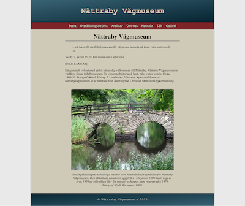

# Nättraby Road Museum

Created as part of the Web Technologies course to represent an open-air museum showcasing Sweden’s roads by land, rail, water, and ice.

Designed and implemented the website end-to-end, including database-driven content, image galleries, articles, and a search feature. This project demonstrates skills in HTML, CSS, PHP, database integration (SQLite), dynamic content loading, and full-stack web development fundamentals.

## Run locally:

1. Clone repo → copy to XAMPP htdocs
2. Start Apache in XAMPP
3. Open http://localhost/road-museum/public/home.php